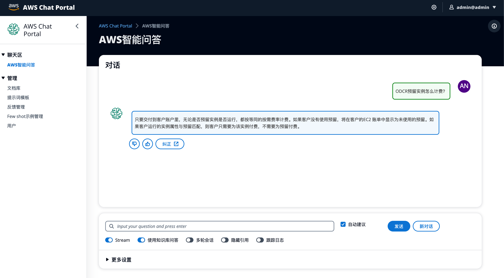

### 私域知识问答

- 系统架构
  

- 前端界面
  
  
  
- 部署方式
  参考 [workshop](https://catalog.us-east-1.prod.workshops.aws/workshops/158a2497-7cbe-4ba4-8bee-2307cb01c08a/zh-CN)
  注意事项:
  + OpenSearch index的创建方法需要参见下文，不能用workshop中的代码
  + 不要使用workshop中的前端链接，请使用[网页](http://chatbotfe-1170248869.us-west-2.elb.amazonaws.com/chat#)

- 代码介绍

  ```python
  .
  ├── code
  │   ├── main.py                          # lambda 部署主文件
  │   ├── aos_write_job.py                 # aos 倒排和knn索引构建脚本 (glue 部署)
  │   ├── batch_upload_docs.py             # 批量倒入知识的脚本实现
  │   ├── chatbot_logs_func.py             # 对Cloudwatch输出的日志解析，通过KDF同步到OpenSearch (lambda 脚本)
  │   ├── offline_trigger_lambda.py        # 调度 glue 的 lambda 脚本
  │   ├── QA_auto_generator.py             # 基于文档自动生成FAQ知识库 (离线前置处理)
  │   └── build_and_push.sh                # 构建ECR Image 供部署后台主服务
  ├── deploy
  │   ├── lib/                             # cdk 部署脚本目录
  │   └── gen_env.sh                       # 自动生成部署变量的脚本(for workshop)
  ├── docs
  │   ├── intentions/                      # 意图识别的示例标注文件
  │   ├── aws_cleanroom.faq                # faq 知识库文件
  │   ├── aws_msk.faq                      # faq 知识库文件
  │   ├── aws_emr.faq                      # faq 知识库文件
  │   ├── aws-overview.pdf                 # pdf 知识库文件
  │   └── PMC10004510.txt                  # txt 纯文本文件
  ├── doc_preprocess/                      # 原始文件处理脚本
  │   ├── ...                              
  │   └── ...                  
  ├── notebook/                            # 各类notebook
  │   ├── embedding                        # 部署embedding模型的notebook，包括bge, text2vec, paraphrase-multilingual, 以及finetune embedding模型的脚本    
  │   ├── llm                              # 部署LLM模型的notebook，包括chatglm, chatglm2, qwen, buffer-instruct-baichuan-001
  │   ├── mutilmodal                       # 部署多模态模型的notebook，包括VisualGLM                         
  │   └── ...     
  ```

- 流程介绍

  - 离线流程
    - a1. 前端界面上传文档到S3
    - a2. S3触发Lambda开启Glue处理流程，进行内容的embedding，并入库到AOS中
    - b1. 把cloud watch中的日志通过KDF写入到AOS中，供维护迭代使用
  - 在线流程[网页](http://chatbotfe-1170248869.us-west-2.elb.amazonaws.com/chat#)
    - a1. 前端界面发起聊天，调用AIGateway，通过Dynamodb获取session信息
    - a2. 通过lambda访问 Sagemaker Endpoint对用户输入进行向量化
    - a3. 通过AOS进行向量相似检索
    - a4. 通过AOS进行倒排检索，与向量检索结果融合，构建Prompt
    - a5. 调用LLM生成结果 
    - 前端[网页](http://chatbotfe-1170248869.us-west-2.elb.amazonaws.com/chat#)切换模型

- 知识库构建
  
  + 构建Opensearch Index
    其中**doc_type**可以为以下四个值**['Question','Paragraph','Sentence','Abstract']**
    
    ```shell
    PUT chatbot-index
    {
        "settings" : {
            "index":{
                "number_of_shards" : 1,
                "number_of_replicas" : 0,
                "knn": "true",
                "knn.algo_param.ef_search": 32
            }
        },
        "mappings": {
            "properties": {
                "publish_date" : {
                    "type": "date",
                    "format": "yyyy-MM-dd HH:mm:ss"
                },
                "idx" : {
                    "type": "integer"
                },
                "doc_type" : {
                    "type" : "keyword"
                },
                "doc": {
                    "type": "text",
                    "analyzer": "ik_max_word",
                    "search_analyzer": "ik_smart"
                },
                "content": {
                    "type": "text",
                    "analyzer": "ik_max_word",
                    "search_analyzer": "ik_smart"
                },
                "doc_title": {
                    "type": "keyword"
                },
                "doc_category": {
                    "type": "keyword"
                },
                "embedding": {
                    "type": "knn_vector",
                    "dimension": 768,
                    "method": {
                        "name": "hnsw",
                        "space_type": "cosinesimil",
                        "engine": "nmslib",
                        "parameters": {
                            "ef_construction": 512,
                            "m": 32
                        }
                    }            
                }
            }
        }
    }
    ```
  
- Script/Notebook 使用方法
  - QA_auto_generator.py 

    ```shell
    # step1: 设置openai key的环境变量
    export OPENAI_API_KEY={key}
    
    # step2: 执行
    python QA_auto_generator.py --input_file ./xx.pdf --output_file ./FAQ.txt \
        --product "Midea Dishwasher" --input_format "pdf" --output_format "json" \
        --lang zh
    ```
